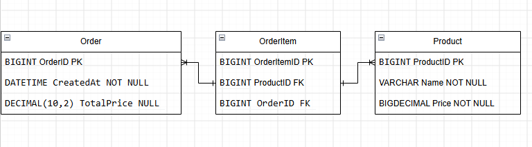

# Order Managment
REST API to manage orders 

## Database Design:

- Product has a name(varchar) and price(bigDecimal)
- Order has a totalPrice for easy lookup (bigDecimal)
- Many to Many relationship between Order and Product using the OrderItem table
- OrderItem has quantity that determines the quantity of a specific Item linked to an Order